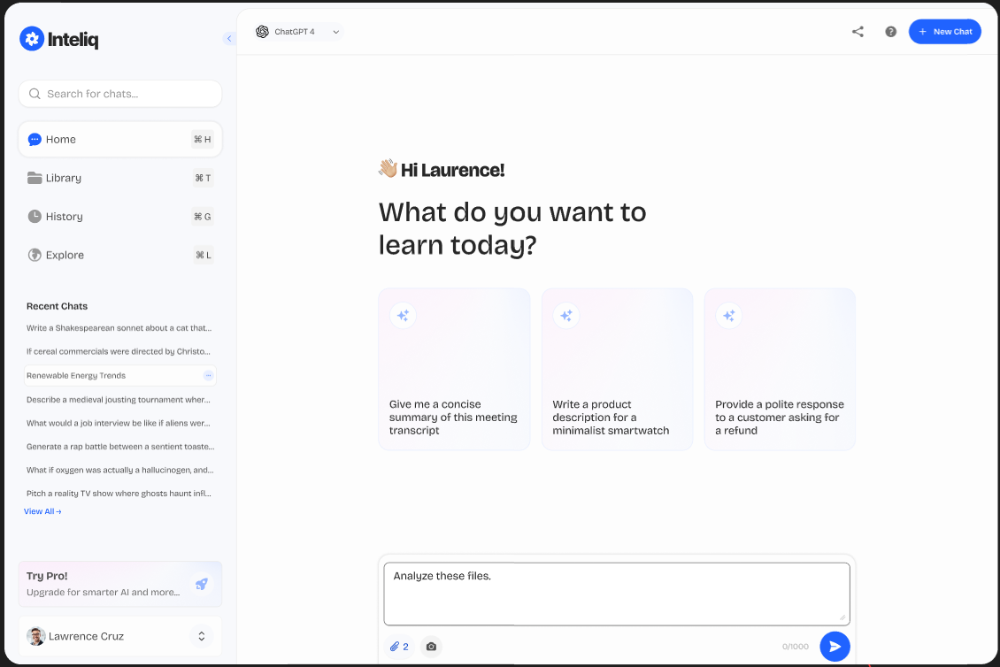
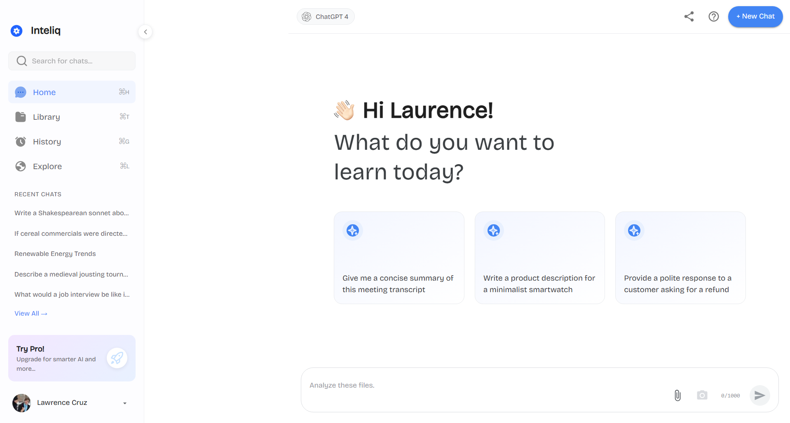

# Inteliq UI Clone

A responsive chat interface with a collapsible sidebar, message history, and file attachment capabilities.

## Preview

<div style="display: flex; justify-content: space-between; margin: 20px 0;">
  <div style="flex: 1; margin-right: 10px;">
    
    <p style="text-align: center; margin-top: 8px; font-size: 0.9em;">Original Figma Design</p>
  </div>
  <div style="flex: 1; margin-left: 10px;">
    
    <p style="text-align: center; margin-top: 8px; font-size: 0.9em;">Implemented Design</p>
  </div>
</div>

## 🚀 Features

- **Collapsible Sidebar** with smooth animations
- **Search Functionality** to filter through chat history
- **Quick Action Cards** for preset messages
- **File Attachments** with drag & drop support
- **Responsive Design** that works on different screen sizes
- **Modern UI** with clean and intuitive interface

## 🛠️ Prerequisites

- Node.js (v14 or later)
- npm (v6 or later) or Yarn
- Groq API key (for AI integration)

## 🚀 Getting Started

### 1. Clone the Repository

```bash
git clone https://github.com/your-username/nextdoc-assignment.git
cd nextdoc-assignment
```

### 2. Install Dependencies

Using npm:
```bash
npm install
```

Or using Yarn:
```bash
yarn install
```

### 3. Environment Setup

Create a `.env` file in the root directory and add your Groq API key:

```env
VITE_GROQ_API_KEY=your_groq_api_key_here
```

### 4. Start Development Server

```bash
npm run dev
# or
yarn dev
```

Open [http://localhost:3000](http://localhost:3000) to view it in your browser.

## 🧪 Available Scripts

- `npm run dev` - Start development server
- `npm run build` - Build for production
- `npm run preview` - Preview production build locally
- `npm run lint` - Run ESLint
- `npm run type-check` - Run TypeScript type checking

## 📁 Project Structure

```
src/
├── assets/          # Static assets (images, icons)
├── components/      # Reusable UI components
│   ├── ChatWindow/  # Chat interface components
│   └── Sidebar/     # Sidebar components
├── types/           # TypeScript type definitions
└── App.tsx          # Main application component
```

## 🤝 Contributing

1. Fork the repository
2. Create your feature branch (`git checkout -b feature/AmazingFeature`)
3. Commit your changes (`git commit -m 'Add some AmazingFeature'`)
4. Push to the branch (`git push origin feature/AmazingFeature`)
5. Open a Pull Request

## 📝 License

This project is licensed under the MIT License - see the [LICENSE](LICENSE) file for details.

---

